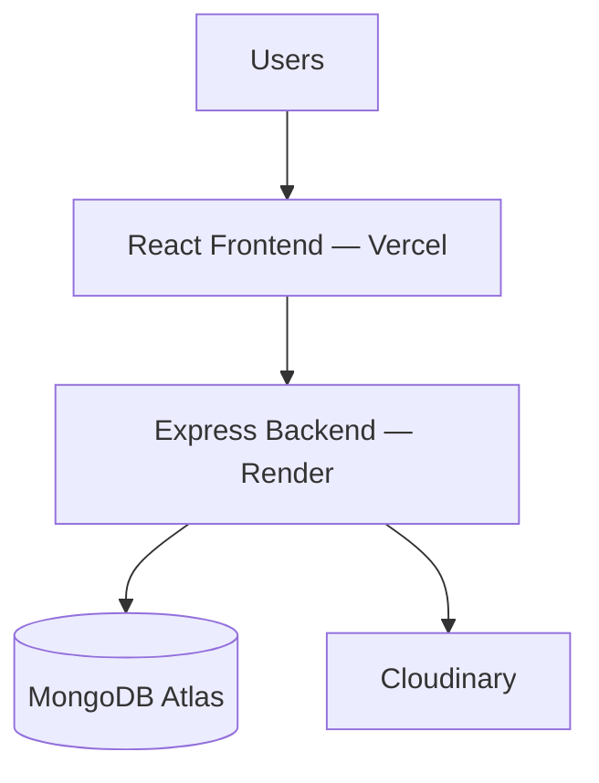

# 9. Deployment Architecture

## Deployment Diagram

## Deployment Layers

| Layer | Platform | Purpose |
|---|---|---|
| Frontend | Vercel | Builds and serves the React app via global CDN |
| Backend | Render | Hosts the Express REST API |
| Database | MongoDB Atlas | Managed cloud database for all collections |
| Image Storage | Cloudinary | Stores and serves uploaded images |

## Environment Variables

| Variable | Purpose |
|---|---|
| `MONGO_URI` | MongoDB Atlas connection string |
| `JWT_SECRET` | Secret key for signing/verifying JWTs |
| `CLOUDINARY_API_KEY` / `CLOUDINARY_API_SECRET` | Cloudinary credentials |
| `CLIENT_URL` | Deployed frontend URL, used for CORS |
| `PORT` | Port the Express server runs on |

## Deployment Workflow

1. Code is pushed to the version control repository (GitHub)
2. Vercel automatically builds and deploys the React frontend
3. Render automatically builds and deploys the Express backend
4. Both services read configuration from platform-level environment variables
5. The deployed frontend communicates with the backend, which connects to MongoDB Atlas and Cloudinary in production

---
⬅️ [Previous: Security](./08-security.md) | 🏠 [Documentation Home](./README.md)

*Built for Smart India Hackathon (SIH)*